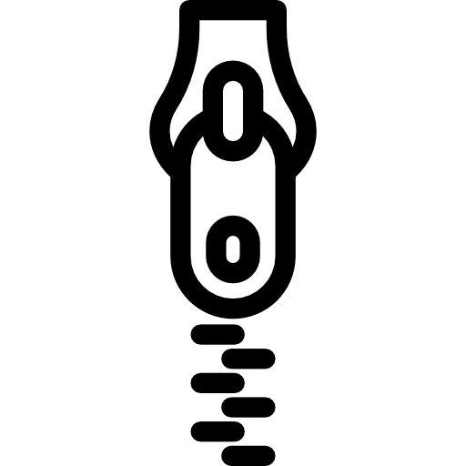

# Zipper [](https://goreportcard.com/report/github.com/pratikbin/zipper)



`zipper` create multiple zip files of X MB

> for my friend savan

## Usage

```bash
zipper <size> <target>
```

- Size in KB. Default 3000 which is 3MB
- target: folder/directory to compress

## Local

> Create docker buildx builder if using first time
> ```docker buildx create --use```

> `slim` variant is UPX compressed

```shell
git clone --depth 1 https://github.com/pratikbin/zipper.git zipper
cd zipper

## Get zipper binary
docker buildx bake

## Get slim zipper binary
docker buildx bake artifact-slim

## Get slim and standard multi-platform zipper binaries
docker buildx bake artifact-all
```

*Check `dist` directory for binaries*

```shell
## Build image
docker buildx bake image

## Build slim image
docker buildx bake image-slim

## Build multi-platform image
docker buildx bake image-all

## Build multi-platform slim image
docker buildx bake image-all-slim
```

Container image availabel for

- **linux**: `amd64`, `386`, `arm64`, `riscv64`, `ppc64le`, `s390x`, `mips64le`, `mips64`, `arm/v7`, `arm/v6`

- **windows**: *available soon*

Binaries available for

- **linux**: `amd64`, `386`, `arm64`, `riscv64`, `ppc64le`, `s390x`, `mips64le`, `mips64`, `arm/v7`, `arm/v6`

- **darwin**: `amd64`(Intel), `arm64` (M1)

- **windows**: `amd64`, `386`, `arm64`, `arm`

- **freebsd**: `amd64`, `386`, `arm64`, `arm`

## Debug

### Testing

```shell
bazel test //...
```

### Profiling

```shell
go build -ldflags="-X main.profEnable=true" ./cmd/zipper/
```

#### CPU and Memory profiling

```shell
go tool pprof -http=:8080 mem.pprof &
go tool pprof -http=:8081 cpu.pprof
```

<!-- **OR** -->
<!--
```shell
go test -cpuprofile cpu.prof -memprofile mem.prof -bench ./cmd/zipper/
``` -->

#### Tracing

```shell
go tool trace trace.out
```

> <div>Icons made by <a href="https://www.freepik.com" **title**="Freepik">Freepik</a> from <a href="https://www.flaticon.com/" title="Flaticon">www.flaticon.com</a></div>

### Build files

```shell
bazel run //:gazelle
```

### Go deps

```shell
bazel run //:gazelle -- update-repos -from_file=go.mod -to_macro=deps.bzl%go_dependencies
```

## To-Do

- [ ] Use existing buffer for zip creation
- [ ] Replace queue with channels
- [ ] Try bazel
- [ ] Add structured logging `<TYPE>: <TIME> :`
- [x] Check goroutine leak
- [x] Create zipping worker with channels
- [x] Go routines to handle zipping
- [x] Don't change source dir name
- [x] Configure size of zip from ~~env~~ cli
- [x] docs: mkdocs CI
<!-- Was part of resizer CLI - [x] What if photo size is less then given zip size -->
- [x] Testing
  - [x] e2e
- [x] **README** Badges

---

*May the source be with you*
